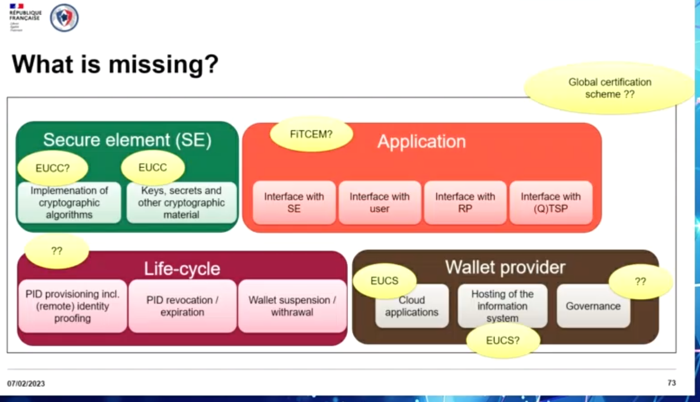
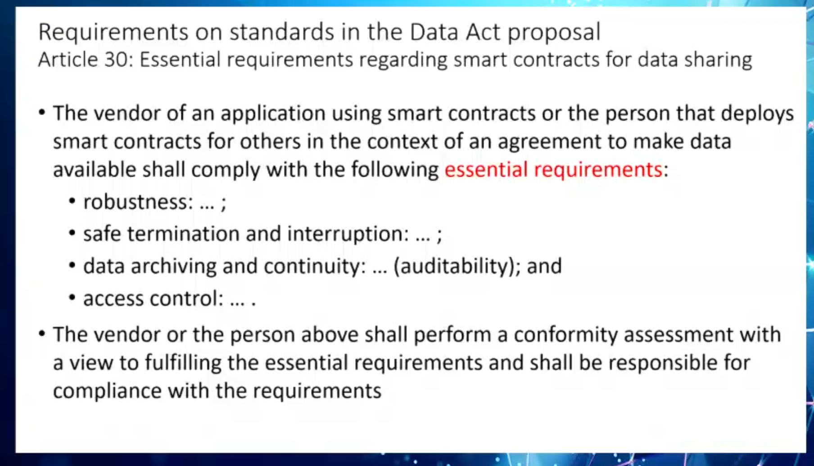
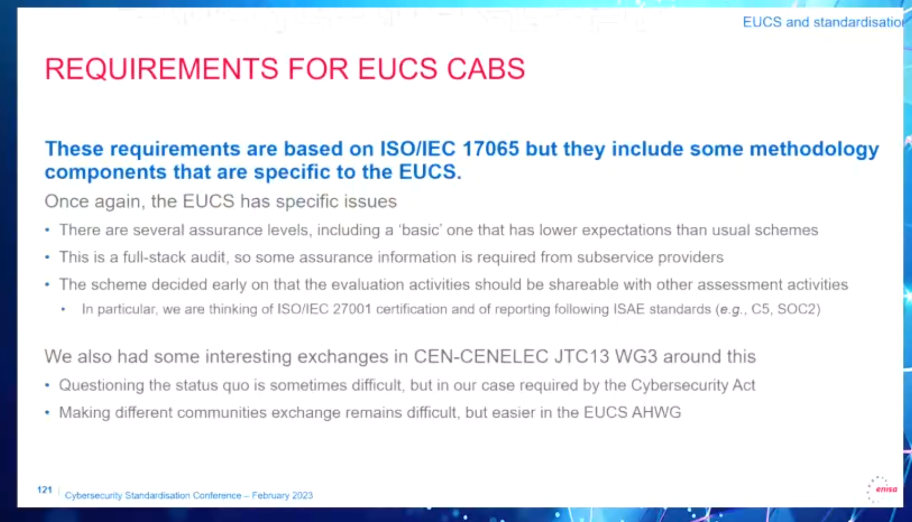

# Personal Notes \| from the Cybersecurity Standardisation Conference 2023

\#Standards4Cyber

## For Whom:

The
[conference](https://www.enisa.europa.eu/events/cybersecurity_standardisation_2023)
aims to foster dialogue among policy makers, industry, research and
standardisation organisations, in view of an effective implementation of
the EU cybersecurity legislation[^1][^2]. The event attracted 3000
registered experts in 2022.

The European Standardisation Organisations
[CEN](https://www.cencenelec.eu/european-standardization/),
[CENELEC](https://www.cencenelec.eu/) and [ETSI](https://www.etsi.org/),
are pleased to join forces with [ENISA](https://www.enisa.europa.eu/),
the EU Agency for Cybersecurity, to organise the 7th [Cybersecurity
Standardisation
Conference](https://www.enisa.europa.eu/events/cybersecurity_standardisation_2023)
**‘European Standardisation in support of the EU Legislation’
Cybersecurity Standardisation Conference 2023**

The 2023 programme of this well-recognized conference will
have dedicated sessions on standardisation activities in the areas
related to the emerging EU legislation:

- [Proposed Cyber Resilience
  Act](https://digital-strategy.ec.europa.eu/en/library/cyber-resilience-act)
- Reviewed
  [eIDAS](https://www.consilium.europa.eu/en/press/press-releases/2022/12/06/european-digital-identity-eid-council-adopts-its-position-on-a-new-regulation-for-a-digital-wallet-at-eu-level/)
  Regulation
- [RED](https://single-market-economy.ec.europa.eu/sectors/electrical-and-electronic-engineering-industries-eei/radio-equipment-directive-red_en)
  Directive, proposed [EU Chips
  Act](https://commission.europa.eu/strategy-and-policy/priorities-2019-2024/europe-fit-digital-age/european-chips-act_en),
  [Data
  Act](https://ec.europa.eu/commission/presscorner/detail/en/ip_22_1113),
  [AI
  Act](https://eur-lex.europa.eu/legal-content/EN/TXT/?uri=celex%3A52021PC0206)
  and others.

> Additional information:

- About the 7th annual conference: [How Cybersecurity Standards Support
  the Evolving EU Legislative
  Landscape](https://www.enisa.europa.eu/news/how-cybersecurity-standards-support-the-evolving-eu-legislative-landscape)

- [A Europe fit for the digital
  age](https://commission.europa.eu/strategy-and-policy/priorities-2019-2024/europe-fit-digital-age_en)

- Article by the `International Association of Privacy Professionals`
  from [Luca Bertuzzi](https://twitter.com/BertuzLuca): [What the EU has
  in store for
  2023](https://iapp.org/news/a/what-the-eu-has-in-store-for-2023/)
  *Summary: “With the European elections in spring 2024 fast
  approaching, in the next 12 months, EU policymakers will focus on
  closing the most important legislative files.”*

------------------------------------------------------------------------

## Panel oversight (in order)

### Panel 1: Future of EU standardisation - regional vs. international

> Speaker(s)

- [Christiane Kirketerp de
  Viron](https://op.europa.eu/en/web/who-is-who/person/-/person/COM_00003AA7A7A0) -
  [European Commission](https://commission.europa.eu/index_en) -
  [Digital Privacy
  Policy](https://op.europa.eu/en/web/who-is-who/organization/-/organization/CNECT/COM_CRF_245675)
- [Elena Santiago Cid](https://www.scc.ca/en/elena-santiago-cid) -
  [CEN-CENELEC](https://www.cencenelec.eu/)
- [Wolfgang
  Niedziella](https://www.cencenelec.eu/about-cenelec/structure-and-governance/cenelec-board-members/) -
  [CEN-CENELEC](https://www.cencenelec.eu/)
- [Luis Jorge
  Romero](https://www.etsi.org/newsroom/news/1574-2019-04-etsi-re-elects-director-general-luis-jorge-romero) -
  [ETSI](https://www.etsi.org/)
- [Andreas
  Mitrakas](https://www.rsaconference.com/experts/andreas%20mitrakas) -
  [ENISA](https://www.enisa.europa.eu/)

### Panel 2: Cyber Resilience Act - a game changer, how the standards can support it?

> Speaker(s)

- [Maika
  Fohrenbach](https://op.europa.eu/en/web/who-is-who/person/-/person/COM_0000CA706CD3) -
  [European Commission](https://commission.europa.eu/index_en)
- [Samim
  Ahmadi](https://scholar.google.de/citations?user=orNo2A8AAAAJ&hl=de) -
  [umlaut](https://www.umlaut.com/)
- [Gisela Meister](https://eucyberact.org/speaker/gisela-meister/) -
  [Eurosmart](https://www.eurosmart.com/)
- [Philippe
  Magneron](http://lpra.org/trade-directory/hager-controls-sas/) -
  [Hager Group](https://hagergroup.com/)
- [Mario Jardim](https://www.enlit-europe.com/speakers/mario-jardim) -
  [Schneider Electric](https://www.se.com/ww/en/) -
  [ECSO](https://ecs-org.eu/)

### Panel 3: eIDASv2 - Where are we heading with digital identities?

> Speaker(s)

- [Dietmar
  Gattwinkel](https://op.europa.eu/en/web/who-is-who/person/-/person/COM_00006A0C2DFF) -
  [European Commission](https://commission.europa.eu/index_en)
- [Viky
  Manaila](https://cloudsignatureconsortium.org/committee/viky-manaila/) -
  [Intesi Group](https://www.intesigroup.com/)
- [Andrea Rock](https://womenwhoadvance.eu/andrea-rock/) -
  [ANSSI](https://www.ssi.gouv.fr/)
- [Chiara Giovannini](https://www.anec.eu/about-anec/our-anec-staff) -
  [ANEC](https://www.anec.eu/)
- [Wojciech
  Wiewiorowski](https://edps.europa.eu/about-edps/members-mission/supervisors/wojciech-wiewi%C3%B3rowski_en) -
  [EDPS](https://edps.europa.eu/)

### Panel 4: Landscape of the EU cybersecurity legislation

> Speaker(s)

- [Ben Kokx](https://eucyberact.org/speaker/ben-kokx/) -
  [Philips](https://www.philips.com/)
- [George Sharkov](https://cetef.eu/en/speakers/dr-george-sharkov/) -
  [ESI CEE](https://esicenter.bg/)
- [Mariela
  Pavlova](http://www-sop.inria.fr/everest/personnel/Mariela.Pavlova/) -
  [Infineon](https://www.infineon.com/)
- [Andrea Caccia](https://www.digitalsme.eu/members/acaccia/) - [Studio
  Caccia](https://cineuropa.org/en/filmography/245252/)
- [Eric
  Vetillard](https://ecosystemexperience.ovhcloud.com/en/speakers?modal=speaker&speakerId=bvcwFR1MyF) -
  [ENISA](https://www.enisa.europa.eu/)

------------------------------------------------------------------------

# Panel 1: Future of EU standardisation - regional vs. international

## Christiane Kirketerp de Viron - European Commission - Digital Privacy Policy

Digitalization cannot go without cybersecurity investments

  
- Harmonizing standards  
- Direct governance & involvement with direct legislative to
representing the citizens - Openness to cooperate with international
partners

## Elena Santiago Cid - CEN-CENELEC

  
1. Lack of awareness  
2. Reacting after harm is done  
3. Short on investment in security  
- Reducing market fragmentation by sharing values, influencing
decisions, and practicing optimization and delivering standards
(national and international)

## Wolfgang Niedziella - CENELEC

  
- About the Radio Equipment Directive (RED), requirement for
Standardization, Standards and breaking Data Silos  
- Trustworthiness and reliable services and products, TTC and [EU-India
TTC](https://ec.europa.eu/commission/presscorner/detail/en/ip_23_596)
and contributing effectively

## Luis Jorge Romero - ETSI

  
- Global Landscape:  
- National - Regional - International  
- avoiding fragmantation  
- Looking forward: Global use  
- Europe is unique, bringing value to the world  
- Focus on global cooperation, commitment, and involvement, that aims to
further elevate education, interconnecting through openness and
availability to drive costs down

## Andreas Mitrakas - ENISA

  
- Business, competition, and standardization strategies for applications
to come that allow framework layering and break down data silos -
Proposals for standards, as well as definitions and endorsements for
public standards  
- Identifying standardization gaps, and developing follow-up proposals

# Panel 2: Cyber Resilience Act - a game changer, how the standards can support it?

## Maika Fohrenbach - European Commission

  
- Use of EU-wide certification schemes that can coexist and align with
current available certifications

## Samim Ahmadi - umlaut

  
- Increasing demand of standartization experts in diverse fields

## Gisela Meister - Eurosmart

 - Using CSA Schemes  
- Included in the EU’s new CSA requirement

 - Risk assessments by Eurosmart

  
- IoT: ETSI EN 303645  
- See EN 303645 for standards and private schemas for use as harmonized
standards - Always have hope, be positive, and cooperate to tackle the
challenges ahead

## Philippe Magneron - Hager Group

 - Using CSA Schemes  
- Included in the EU’s new CSA requirement

 - Risk assessments by Eurosmart

  
- Regulations aim to help, not hinder  
- Product-categories to be more recognizable and accepted -
Requirements  
- Tests

## Mario Jardim - Schneider Electric, ECSO

  
- Leverage of industry standards  
- Combination of sharing external and internal parties

# Panel 3: eIDASv2 - Where are we heading with digital identities?

Fostering trust through complete transparency. Alternatives to
commercial offerings that do not place the individual at the center.

## Dietmar Gattwinkel - European Commission

  
- Universal availability for European citizens everywhere, i.e., social
login with a privacy focus

  
- Toolbox implementation  
- Working on each of these four strands  
- Concurrently in order to meet deadlines a wide range of applications
for civil and official purposes

## Viki Manaila - Intesi Group

  
- All parties involved understand the opportunities and support their
development - The ability to grant and revoke data access

## Andrea Rock - ANSSI

 - “Wallet” certification

 - CS certification

  
- Demand for certification on the application itself  
- How to evaluate certifications (FiTCEM)  
- How does everything fit together (harmonize) (life cycle)?  
- Challanges:  
- Standards-based  
- Timing, working in tandem to accompany everything.  
- Harmonizations and proofreading; each member state must be taken into
account. - Coorporation between all parties involved and transparency  
- Requierments:  
- Trust service provider and certificates  
- Proper standards  
: Andrea Rock - ANSSI

## Chiara Giovannini - ANEC

- Chiara Giovannini - ANEC  
- Working Group related standards and issues for consumers  
- Should I trust the digital wallet?  
- How can I trust the digital wallet?  
- How can I trust the interactions to be secured between different
  entities  
- What are the costs involved, particularly the initial costs?  
- Digital data is also beneficial  
- Is it reliable?  
- International interoperability and standards are required  
- The wallet’s interaction with the cyber security system will be
  critical  
- Wallet, application, and security certification? -\> Priority: What to
  certify?  
- To stay voluntary  
- Data-quality contained  
- Capacity, responsibility, and equality (Laws against forced use of the
  digital wallet are a precondition)

## Wojciech Wiewiorowski - EDPS

- Wojciech Wiewiorowski - EDPS  
- Data protection authorities on national level  
- Entities linked to transmission in individual member states  
- How to Put It All Together - A framework alone is insufficient  
- Regulations  
- What does the Toolbox accomplish; more specific  
- Are all critical components in place and secure?  
- What about cultural and elemental rights?  
- The authorities in charge of data protection must be involved.  
- failing to discontinue tracking and profiling (how to avoid this; how
  to improve acceptance and usage)  
- Who has the right to alter fundamental rights if the deciding factor
  is diminishing  
- Prior to general data protection certifications… and the threat of
  regulation… an overview of each of those certifications must be
  present
- Discuss individual entities’ concerns and worries  
- Who controls the data; owning is a wrong term and should not be used
  in this context

# Panel 4: Landscape of the EU cybersecurity legislation

## Ben Kokx - Philips

  
- Regulations concerning products that enter the European markets

  
- The development of three harmonized standards with around 167 members

 - RED is only for the product and
what’s inside

  
- Horizontal scopes for RED and CRA standards may serve to restrict use
cases  
- Realization of requirements may reduce usabilities compared to
established requirements - Demand of product scoping and intended use of
products their environment  
- Will the standard be cited? (BIG QUESTION)

## George Sharkov - ESI CEE

  
- Highlighted fields are related to other fields like security

 - Security and resilience by design

## Mariela Pavlova - Infineon

  
- In Europe, ISO 15408 evaluation smart cards and high-end security  
- SESIP for IoT: Targeting MCUs in the IT Area.  
- FITCEM: European Standard, close to CC, but targeting security
evaluations fixed in time - SESIP and FITCEM can be applied to smart
cards and the like sooner or later

  
- SOGIS used since 20years  
- High end security and independent evaluation for certification and
continuous monitoring  
- EUCC is the successor of SOGIS  
- EMVCo proprietary and private  
- PSA Certified and GP SESIP is private -\> evaluate certification for
MCU in IoT Area -\> low-level security, basic and substantial level

## Andrea Caccia - Studio Caccia

  
- Data act standardization breaks down data silos, engages new spaces,
and enables interoperability

  
- Many vendor lock-ins limit the use of data that other stakeholders can
use

  
- Data standardization is required for interoperability in
data-processing services

  
- Interoperability to establish harmonized standards for data access
(e.g., by using APIs) enables smart contracts (related to blockchain)
and lowers the barriers to accessing the data, making it available, and
meeting standard compliance requirements

 - Cloud provider with
interoperability capabilities

  
- The Data Act is one component, and an important challenge for Europe
for enabling a significant data market  
- A standardized platform for data sharing in smart contracts, but
guidance is required to contextualize data and enable interoperability
across different organizations, official organs, and standard bodies

## Eric Vetillard - ENISA

  
- The European Cloud Service Scheme (EUCS) a standard to be applied to
any cloud infrastructure - How well does my cloud service meet the
minimum requirements?  
- Levels: basic, substantial, and high

  
- Requirements for assessment bodies  
- Basic means lower than mainstream certification and slight
modification to modify them just enough

[^1]: [Europe Beefs-Up Cybersecurity Law, Trumping The
    UK](https://www.forbes.com/sites/stewartroom/2023/01/16/europe-beefs-up-cybersecurity-law-trumping-the-uk/?sh=667642056081)

[^2]: [New stronger rules start to apply for the cyber and physical
    resilience of critical entities and
    networks](https://digital-strategy.ec.europa.eu/en/news/new-stronger-rules-start-apply-cyber-and-physical-resilience-critical-entities-and-networks)
